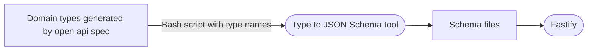

# Schema auto generation

### Tooling:

> TypeScript to Json Schema

> https://github.com/YousefED/typescript-json-schema

## How it works

Fastify serializer consumes JSON Schema, we use our model types generated from our open api spec as input in the schema
generation tool. The output is a [JSON Schema Draft 7](https://json-schema.org/specification-links.html#draft-7).

### Workflow:

1. `Api spec` is updated in the [dex-api-schema](https://github.com/geniusyield/dex-api-schema) repository.

2. Pull and commit updated api spec submodule at `specification/public/open-api`

3. Generate public model types with `yarn generate:open-api:public`

4. Add/remove `array items` from generate JSON Schema bash script.

5. Run JSON Schema generation script `yarn generate:serializer-schemas`

6. Add or remove `fastify schemas` (note: `query parameters` do not have types generated automatically from public and
   must be generated from private types)

7. Add or remove `fastify schemas` from `routes file`

8. `Type-check` code and fix any issues.

For more info about Fastify serialization see: https://www.fastify.io/docs/latest/Reference/Validation-and-Serialization

### For generating a JSON schema file based on a TypeScript type:

- In the `generate-serializer-schemas.sh` bash script add to the array your type name and expected filename.

```bash

Arr["<type name>"]="<expected filename without .json extension>"

```

### Flow:


